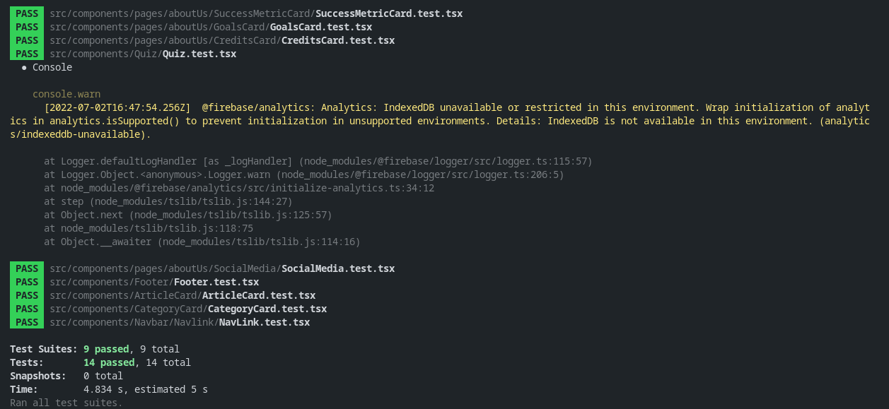

<h1 align="center">
  <a href="https://github.com/irfan44/capstone-fe_ed6">
    
  </a>
</h1>

<div align="center">
  <br />
  <a href="https://capstone-fe-ed6.vercel.app/"><strong>Visit Literanian >></strong></a>
  <br />
</div>

<details open="open">
<summary>Table of Contents</summary>

- [About](#about)
  - [Features](#features)
  - [Built With](#built-with)
  - [Technical Details](#technical-details)
- [Getting Started](#getting-started)
  - [Prerequisites](#prerequisites)
  - [Installation](#installation)
- [Usage](#usage)
  - [Step by Step](#step-by-step)
  - [Testing](#testing)
- [Credits](#credits)
- [Feedback](#feedback)

</details>

---

## About

Literanian is a digital literacy website that contains factual and interesting articles accompanied by images or animations to increase user interest in reading and increase interest in the material. Each material provided will be accompanied by practice questions or multiple choice quizzes to increase user interaction. To increase the user's incentive to read the material, after the user completes a quiz, there will be a number of points given to the user. These points will be accumulated and there will be several checkpoints of the number of points, for example at 50, 100, or 1000, that users can achieve and use to unlock premium articles for free. The existence of these incentives is carried out to keep users interested in reading and increase the frequency of reading. User will need to login before they can access articles.

This project is part of Capstone Project for Generasi Gigih 2.0 from team FE-ED6.


### Features

1. User login/registration using Google account.
2. Displays a variety of interesting material to read.
3. Display practice questions and quizzes
4. Collect points when the user answers the quiz correctly.
5. Unlock premium articles at certain checkpoints (example: at 50, 80, 100, 500, etc).

### Built With

1. [Create React App](https://create-react-app.dev/) to initialize the project.
2. Written in [Typescript](https://www.typescriptlang.org/)
3. [Chakra UI](https://chakra-ui.com/) for building UI
4. [React Redux](https://react-redux.js.org/) for state management
5. [React Router](https://reactrouter.com/) for routing
6. [GraphCMS](https://www.graphcms.com/) for content management
7. [GraphQL Request](https://github.com/prisma-labs/graphql-request) for making GraphQL calls to GraphCMS
8. [Firebase](https://firebase.google.com/) for authentication (Auth) & database (Firestore)
9. [Jest](https://jestjs.io/) for testing
10. Deployed on [Vercel](https://vercel.com/)

### Technical Details

1. Implements firebase auth to authenticate user using Google.
2. Implements firebase firestore to store user premium status, premium expiry, and points.
3. Implements Redux to store data from firebase auth & firestore as state.
4. Implements React Router to route user to different pages.
5. Implements GraphCMS for article management.
6. Implements GraphQL Request for making GraphQL calls to GraphCMS.

## Getting Started

### Prerequisites

1. Google account
2. Setting up Firebase Application from [Firebase Console](https://console.firebase.google.com/). Make sure to save all neccessary keys.
3. Setting up GraphCMS project from [GraphCMS Dashboard](https://app.graphcms.com/). Make sure to save public content url to be added to `REACT_APP_GRAPHCMS_CONTENT_API`.
4. NodeJS installed in your machine
5. Git

### Installation

1. Clone repo to your local machine. After it finished, open the folder and install project dependencies. You can do this from your command line/terminal :

```bash
# Clone this repository
$ git clone https://github.com/irfan44/capstone-fe_ed6.git
# Go to repository folder
$ cd capstone-fe_ed6
# Install dependencies
$ npm install
```

2. Copy and rename `.env.example` to `.env.local` then insert your firebase and graphcms keys to they respective fields.

```bash
# .env.local example
REACT_APP_FIREBASE_API_KEY=2r6yMhW9FDoccEnjUJA3-mY6UO59Ovi79vtQGRD
REACT_APP_FIREBASE_AUTHDOMAIN=projectname.firebaseapp.com
REACT_APP_FIREBASE_PROJECT_ID=projectname
REACT_APP_FIREBASE_STORAGEBUCKET=projectname.appspot.com
REACT_APP_FIREBASE_MESSAGINGSENDER_ID=102232492553
REACT_APP_FIREBASE_APP_ID=1:102232492553:web:u99opwcqi3hsfl52o26tqw
REACT_APP_FIREBASE_MEASUREMENT_ID=G-LJNTS756GX
REACT_APP_GRAPHCMS_CONTENT_API=https://api-ap-south-1.graphcms.com/v2/37Bpw7eX4JzfAWfTYjNYTYjNY/master
```

3. Run the app

```bash
$ npm start
```

4. Open `http://localhost:3000` to view the app in your browser

## Usage

### Step by Step

1. Open `http://localhost:3000` or `https://capstone-fe-ed6.vercel.app/` to view the app in your browser
2. Go to login page using "Masuk" button and login using your Google account by clicking "Masuk dengan Google".
3. Read articles available in "Eksplorasi" page or select one of the categories in "Kategori" page.
4. Complete quiz and click "Klaim" button to claim points.
5. At certain checkpoints, you can unlock premium articles by clicking "Klaim Premium!" button available in "Eksplorasi" page.

### Testing

Run `npm test` from your command line/terminal.



## Credits

Thanks to everyone who contributed to this project :

- [Dyah Ayu Arimbi](https://github.com/dyahayuarimbi)
- [Fahri Syabani](https://github.com/fahrisyabani)
- [Irfan Nurghiffari Muhajir](https://github.com/irfan44)
- [Izazih Rahmatina](https://github.com/izazih)

Special thanks to [Yayasan Anak Bangsa Bisa](https://www.anakbangsabisa.org/) for this opportunity to join [Generasi Gigih](https://www.anakbangsabisa.org/generasi-gigih/)

## Feedback

Reach out to the maintainer at one of the following places:

- [GitHub issues](https://github.com/irfan44/capstone-fe_ed6/issues/new)
- Contact options listed on [this GitHub profile](https://github.com/irfan44)
